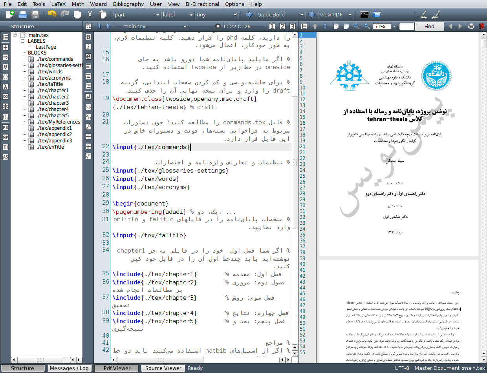
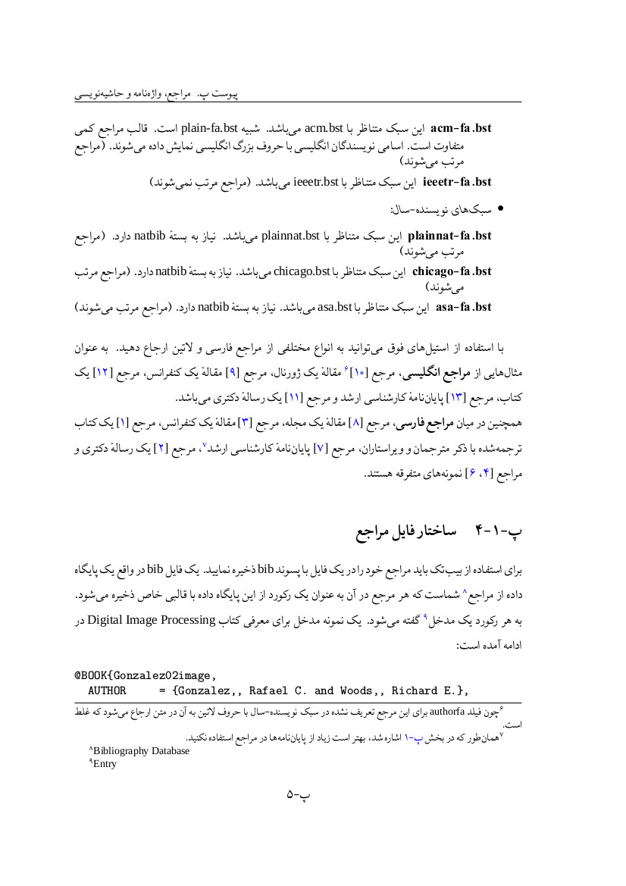
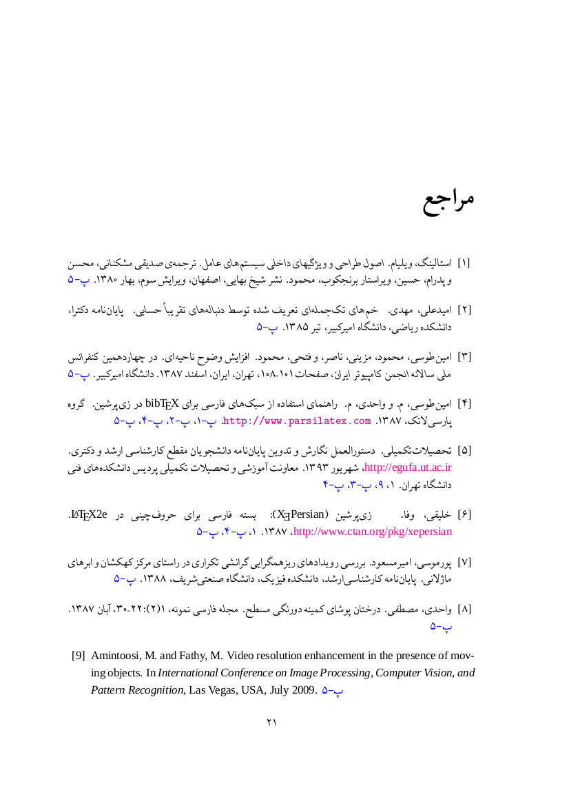
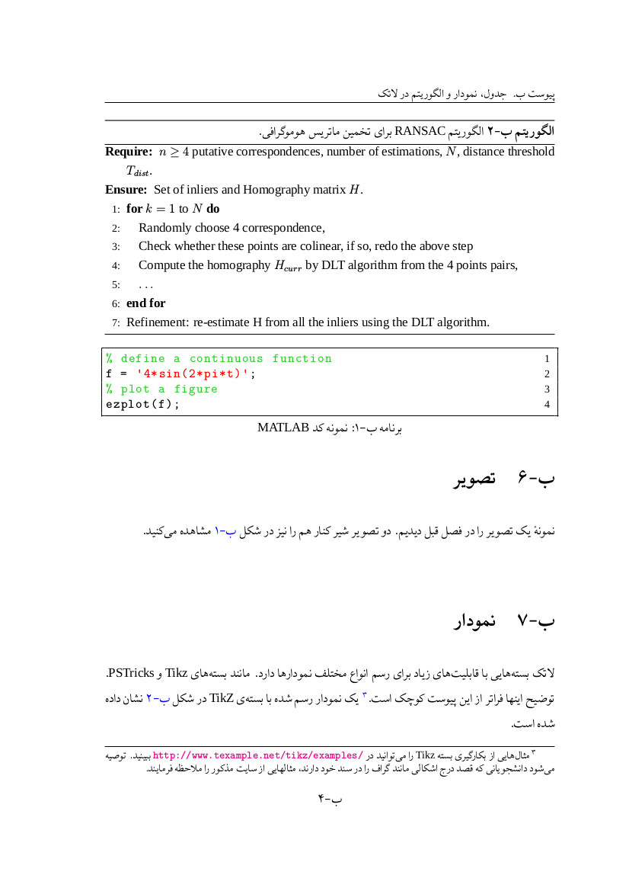
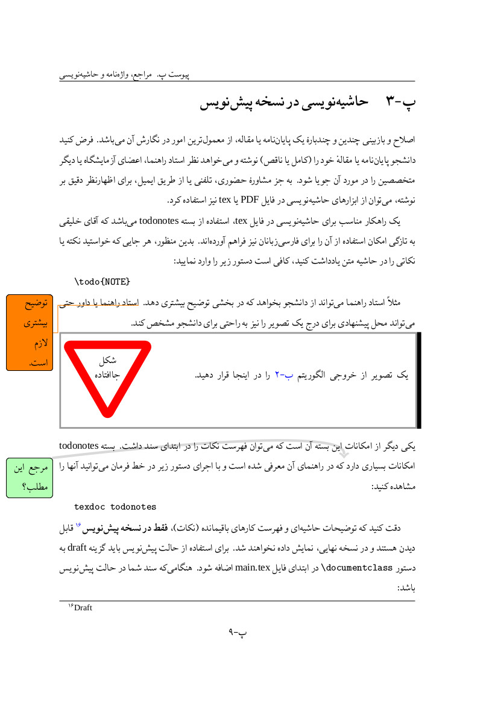

# tehran-thesis

[](https://github.com/sinamomken/tehran-thesis/releases/latest)
[](https://github.com/sinamomken/tehran-thesis/actions/workflows/build.yml)

LaTeX template for MSc/BSc/PhD theses of University of Tehran.
<div dir="rtl">قالب لاتک پایان‌نامه دانشگاه تهران</div>

<div dir="rtl">

## راهنمای فارسی
### ویژگی‌ها
1. منطبق با [«دستورالعمل نگارش و تدوین پایان‌نامه» دانشگاه تهران، ویرایش اول، شهریور ۱۳۹۲][egufa site].
1. طراحی مدولار و انعطاف‌پذیر، به همراه دستورات از پیش‌تعریف‌شده برای مشخصات متغیر یک پایان‌نامهٔ دانشگاه تهران (مثل عنوان، نام دانشچو، استاد راهنما، تاریخ و غیره).
1. ‫استفاده از قلم‌های استاندارد [سری X نسخهٔ ۲][irmug-persian] یا قلم‌های استاندارد سری [IRFonts][irfonts] اثر شورای عالی اطلاع‌رسانی (به جای قلم‌های غیراستاندارد BFonts).
1. ‫ساخته شده بر اساس قالب‌های پیشرفته‌های [IUST-Thesis][iust-template] و HSU-Thesis-V1 اثر دکتر محمود امین‌طوسی.
1. حاوی توضیحات گویا در مورد چگونگی استفاده از این قالب و نیز نکات لازم در مورد نوشتن هر فصل یک پایان‌نامهٔ دانشگاه تهران.
1. قابلیت انتخاب سبک‌های ارجاع‌دهی فارسی گوناگون برای رشته‌های مختلف، مطابق با سیستم‌های شماره‌دار و نویسنده-سال.
1. ‫مدیریت هوشمند واژه‌نامه‌ها و درج اصطلاحات تخصصی، با استفاده از بستهٔ `glossaries` و موتور `xindy`.
1. ‫قابلیت حاشیه‌نویسی مستقیم در فایل‌های TeX در حالت پیش‌نویس، با استفاده از بستهٔ `todonotes`.
1. امکان درج شکل‌ها، جداول مختلف، نمودارهای `tikz`، الگوریتم‌های فارسی و لاتین و کدهای رنگی؛ بعلاوهٔ فهرست‌هایی از آنها.
1. سربرگ استاندارد، فاصلهٔ مناسب حاشیه‌ها در حالت یک‌رو و دورو و شماره‌دهی صفحات منطبق بر دستورالعمل نگارش.

### چگونه استفاده کنیم؟

آخرین نسخهٔ منتشرشدهٔ قالب را می‌توانید از
[](https://github.com/sinamomken/tehran-thesis/releases/latest)
دریافت کنید.
با دستور زیر نیز می‌توانید به آخرین نسخهٔ در حال توسعهٔ قالب دسترسی داشته باشید:
<div dir="ltr">

```bash
git clone https://github.com/sinamomken/tehran-thesis --single-branch
```

</div>

‫قالب پایان‌نامهٔ _tehran-thesis_ در واقع یک بستهٔ قابل‌حمل است که بگونه‌ای طراحی شده تا مشخصات متغیر پایان‌نامه توسط دانشجو عوض شود و مطالب پایان‌نامه نیز توسط وی در فصول مختلف وارد گردد. به هیچ تلاشی برای قالب‌بندی نیاز نیست و تنها کافی است دانشجو طبق توضیحات، مطالب خود را وارد نماید.
در نتیجه این قالب به نصب نیاز ندارد. با این حال، این قالب از تکنولوژی‌ها و بسته‌های مختلفی استفاده می‌کند. پیش‌نیازهای زیر قبل از استفاده از قالب باید نصب باشند:

#### پیش‌نیازها
* ‫نصب کامل [`texlive`][texlive] بر روی لینوکس، ویندوز یا [`MacTex`][mactex] بر روی سیستم‌عامل مک. خصوصاً بسته‌های لاتک زیر باید نصب باشند:
  * `زی‌پرشین`: تمام امکانات حروف‌چینی زبان فارسی در این قالب پایان‌نامه، با بستهٔ [`XePersian`][xepersian] فراهم شده است.
  * ‫[`persian-bib`][persian-bib]: سبک‌های ارجاع‌دهی فارسی با این بسته فراهم شده‌اند.
  * ‫[`glossaries`][glossaries]: بسته مدیریت پیشرفتهٔ واژه‌نامه‌ها در لاتک.
  * ‫[`todonotes`][todonotes]: امکان حاشیه‌نویسی و نکته‌گذاری را در فایل‌های TeX شما فراهم می‌آورد.
* ‫`latexmk`: برنامه‌ایست معادل `make` برای پروژه‌های لاتک که مراحل مختلف کامپایل را در صورت نیاز تکرار می‌کند (باید در نسخه کامل `texlive` باشد).
* [`‫bibtex`][bibtex]: برنامهٔ ساخت فهرست مراجع و کتابشناسی (باید در نسخه کامل `texlive` باشد) و بستهٔ [`persian-bib`][persian-bib].
* ‫`xindy`: برنامهٔ پشتی مورد نیاز برای ساخت واژه‌نامه‌ها و نمایه‌ها.
  * زبان `persian` یا `persian-variant3` باید برای [`xindy`][xindy] نصب باشد (که در اوبونتو 16.04 دستی باید دانلود و کپی شود).
* ‫یک ویرایشگر یا IDE برای پروژه‌های TeX، ترجیحاً با پشتیبانی از زبان‌های دوجهته یا راست به چپ، مثل [`BiDiTexmaker`][biditexmaker].
* ‫\[اختیاری\] نصب قلم‌های سری X نسخهٔ ۲ و Junicode در سیستم‌عامل‌تان.

</div>

## English Readme
### Features
1. Compliant with ["Manual of writing and editing thesis of University of Tehran", Sep. 2013][egufa site].
1. Modular and flexible design, with predefined commands for variables of a standard UT thesis (title, name, supervisor, date, ...).
1. Use of standard [X Series 2][irmug-english] fonts or standard [IRFonts][irfonts] by SCICT (instead of non-standard BFonts).
1. Based on professional templates ["IUST-Thesis"][iust-template] and "HSU-Thesis-V1" by Mahmood AminToosi.
1. Contains self-describing texts explaining how to use this template and notes about writing each chapter of a thesis.
1. Ability to choose different Persian bibliography styles for various specialities, compliant with author-number or author-date systems.
1. Smart glossaries management using `glossaries` package and `xindy` backend.
1. Commenting & review directly inside draft version of tex files, by using ` todonotes` package.
1. Ability to include figures, different tabulars, `tikz` diagrams, Persian & English algorithms and colorized code listings; And their catalogue.
1. Standard headers, odd/even margins and page numberings.

### How to Use
It's possible to download the latest released version of template from
[](https://github.com/sinamomken/tehran-thesis/releases/latest).
Also, by the following command you can access to the latest developing version of template:

```bash
git clone https://github.com/sinamomken/tehran-thesis --single-branch
```

_tehran-thesis_ latex template is a portable package, that is designed for customization by the student to fill his/her thesis materials.
Therefor, it doesn't need any installation. However, it uses many technologies to fulfill its duties. Dependencies below must be installed:

#### Prerequisites
* Full [`texlive`][texlive] installation for Linux or Window, Or [`MacTex`][mactex] for MacOS. Specially, latex packages below should be installed:
  * [`XePersian`][xepersian]: All persian properties are based on `XePersian` package.
  * [`persian-bib`][persian-bib]: Bibliography styles are provided by `persian-bib` package.
  * [`glossaries`][glossaries]: Advanced glossary management package.
  * [`todonotes`][todonotes]: Provides commenting and todo notes available in your tex files.
*  `latexmk`: equivalent of `make` for latex projects (should be included in a full `texlive` installation).
* [`bibtex`][bibtex]: bibliography creation backend engine (should be included in a full `texlive` installation) and [`persian-bib`][persian-bib] package.
* [`xindy`][xindy]: glossary/indexing backend engine.
  * `persian` or `persian-variant3` language should be installed for xindy (not available by default in Ubuntu 16.04).
* A TeX editor/IDE with RTL support, e.g. [`BiDiTexmaker`][biditexmaker].
* \[Optional\] X Series 2 & Junicode Fonts installed in your system.

## Screenshots
#### tehran-thesis in BiDiTexmaker  


#### tehran-thesis in BiDiTexmaker (draft mode)  


#### Example of citation to various sources  
 

#### Glossary and index  
 

#### Colorized codes and todo notes (in draft version)  
 

More screenshots are available in [`img`][imgs] folder.

[egufa site]: https://github.com/sinamomken/tehran-thesis/wiki/%D9%85%D8%B3%D8%AA%D9%86%D8%AF%D8%A7%D8%AA-%D9%86%DA%AF%D8%A7%D8%B1%D8%B4-%D9%BE%D8%A7%DB%8C%D8%A7%D9%86%E2%80%8C%D9%86%D8%A7%D9%85%D9%87-%D8%AF%D8%B1-%D9%BE%D8%B1%D8%AF%DB%8C%D8%B3-%D8%AF%D8%A7%D9%86%D8%B4%DA%A9%D8%AF%D9%87%E2%80%8C%D9%87%D8%A7%DB%8C-%D9%81%D9%86%DB%8C-%D8%AF%D8%A7%D9%86%D8%B4%DA%AF%D8%A7%D9%87-%D8%AA%D9%87%D8%B1%D8%A7%D9%86

[irfonts]: https://earmin.com/scict-standard-persian-fonts/

[iust-template]: http://www.parsilatex.com/joomla/index.php/remository/Thesis_Templates/%D8%A7%D8%B3%D8%AA%DB%8C%D9%84-%D9%84%D8%A7%D8%AA%DA%A9-%D8%A8%D8%B1%D8%A7%DB%8C-%D9%BE%D8%A7%DB%8C%D8%A7%D9%86%E2%80%8C%D9%86%D8%A7%D9%85%D9%87%E2%80%8C%D9%87%D8%A7%DB%8C-%DA%A9%D8%A7%D8%B1%D8%B4%D9%86%D8%A7%D8%B3%DB%8C-%D8%AA%D8%A7-%D8%AF%DA%A9%D8%AA%D8%B1%D8%A7%DB%8C-%D8%AF%D8%A7%D9%86%D8%B4%DA%AF%D8%A7%D9%87-%D8%B9%D9%84%D9%85-%D9%88-%D8%B5%D9%86%D8%B9%D8%AA-%D8%A7%DB%8C%D8%B1%D8%A7%D9%86/

[biditexmaker]: http://www.parsilatex.com/joomla/index.php?option=com_remository&Itemid=82&func=select&id=2

[imgs]: https://github.com/sinamomken/tehran-thesis/tree/master/img

[irmug-persian]: http://wiki.irmug.com/index.php/%D9%82%D9%84%D9%85%D9%87%D8%A7%DB%8C_%D8%B3%D8%B1%DB%8C_%D8%A7%DB%8C%DA%A9%D8%B3_%D9%86%D8%B3%D8%AE%D9%87%D9%94_%DB%B2
[irmug-english]: http://wiki.irmug.com/index.php/X_Series_2

[texlive]: https://tug.org/texlive/
[mactex]: https://tug.org/mactex/
[xepersian]: https://ctan.org/pkg/xepersian
[persian-bib]: https://ctan.org/pkg/persian-bib
[glossaries]: https://ctan.org/pkg/glossaries
[todonotes]: https://ctan.org/pkg/todonotes
[bibtex]: https://ctan.org/pkg/bibtex
[xindy]: https://ctan.org/pkg/xindy
